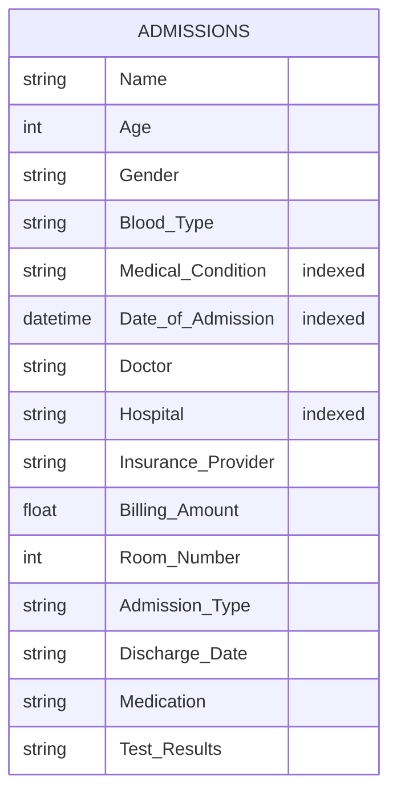

<a id="english-version"></a>
# Healthcare Data ETL Pipeline

*Navigate to: [🇫🇷 Version Française](#version-française)*

## Overview
This project is an automated ETL (Extract, Transform, Load) pipeline. It extracts healthcare patient data from a raw CSV file, cleans and standardizes the data using Python (Pandas), and loads it into a secure, locally-hosted MongoDB database running in a Docker container.

---

## 1. Python Dependencies (`requirements.txt`)
The `requirements.txt` file lists all the external Python libraries required for this script to run (`pandas`, `pymongo`, `python-dotenv`, `pytest`). When you use Docker (recommended, see section 3), these dependencies are installed **automatically** during the image build — you don't need to install anything manually.

**Manual installation (only if you want to run `migrate.py` outside Docker) :**
First, create and activate a virtual environment. Then, install the dependencies by running the following command in your terminal :
```bash
pip install -r requirements.txt
```

## 2. Environment Variables (`.env`)
The `.env` file is used to securely store sensitive credentials outside of the source code. You must create a `.env` file in the project root before launching the stack.

**Structure :**

`MONGO_ROOT_USERNAME=your_secure_username`  
`MONGO_ROOT_PASSWORD=your_secure_password`  
`MONGO_APP_USERNAME=your_app_username`  
`MONGO_APP_PASSWORD=your_app_password`  
`MONGO_ANALYST_USERNAME=your_analyst_username`  
`MONGO_ANALYST_PASSWORD=your_analyst_password`

> **Note: Never push your actual `.env` file to version control. It should be added to your `.gitignore`).**

## 3. Docker Infrastructure (`docker-compose.yml`)

The `docker-compose.yml` file defines and configures **two services** on a shared Docker network (`p05_network`):

* **`mongodb`** : the database. It maps the local port `27017` to the container, reads the `.env` file to create the root user (`MONGO_INITDB_ROOT_USERNAME` / `MONGO_INITDB_ROOT_PASSWORD`), and stores its data in the persistent volume `mongodb_data` so nothing is lost when the container stops.
* **`migration`** : built from the local `Dockerfile` (installs `requirements.txt` at build time). It mounts the `data/` folder (containing `healthcare_dataset.csv`) as a volume, waits for `mongodb` to be ready (`depends_on`), and runs `migrate.py` on startup.

**Authentication and access control :** on top of the root/admin account (used only to administer the database), the `mongo-init.js` script (mounted in `docker-entrypoint-initdb.d`) creates **two additional, restricted roles** on the `medical_data` database :

| User | Role | Purpose |
|---|---|---|
| `app_user` | `readWrite` on `medical_data` | Used by the `migration` service to insert and update the data. This is the account `migrate.py` actually connects with (see section 5). |
| `analyst_user` | `read` on `medical_data` | Intended for a person consulting/analyzing the data (e.g. building reports or dashboards) : read-only, no risk of accidentally altering or deleting production data. |

Separating these roles from the root account limits the damage a compromised or misused credential can do : the ETL script can never accidentally drop the database, and an analyst can never write to it. The `migration` service connects using the Docker service name `mongodb` as the host (via the `MONGO_HOST` environment variable, injected by `docker-compose.yml`) instead of `localhost`, since both containers communicate over the internal `p05_network`.

> **Note :** `mongo-init.js` only runs once, the very first time the `mongodb_data` volume is created. If you change a password in `.env` afterwards, it won't be applied automatically — either reset it manually (`db.changeUserPassword(...)` from `mongosh`) or wipe the volume with `docker compose down -v` and restart.

**How to launch the whole stack (database + migration) :**  
Open your terminal in the project folder and run :
```bash
docker compose up --build
```
This single command builds the `migration` image, starts MongoDB, and executes the ETL script automatically.

**To (re-)run only the migration script**, for example after modifying the CSV :
```bash
docker compose run migration python migrate.py
```

To stop the stack, use : 
```bash
docker compose stop
```

## 4. Database Schema

The `admissions` collection schema (fields, types, indexes) is documented at the end of this document, in a dedicated bilingual section : [🗂️ Jump to Database Schema](#database-schema).

## 5. Data Process : Collection, Processing & Storage

**Collection**
* **Source :** public dataset from Kaggle ("Healthcare Dataset"), downloaded as a single CSV file.
* **Format :** CSV, comma-separated, one row per hospital admission record, 15 columns (see schema in section 4).
* **Frequency :** one-shot / manual load. This project performs a single batch import for the demonstration — there is no scheduled or recurring ingestion. To load an updated dataset, replace `data/healthcare_dataset.csv` and re-run `docker compose run migration python migrate.py` (see section 3).

**Processing**
The `migrate.py` script connects to the MongoDB instance using the `app_user` credentials (`readWrite` role, see section 3) and runs the following pipeline :
1. **Extract** : reads the raw `healthcare_dataset.csv` using the Pandas library.
2. **Clean** : fills empty text fields with "Inconnu", strips leading/trailing whitespace, and normalizes case (Title Case for names, hospitals, and doctors; Capitalize for medical conditions and gender; Uppercase for blood types).
3. **Deduplicate** : removes duplicate rows after text normalization.
4. **Type cast** : strictly converts ages to integers, billing amounts to floats, and string dates to native Python `datetime` objects (handling invalid dates smoothly).
5. **Load** : clears the existing `admissions` collection, then performs a bulk insert of all cleaned documents.
6. **Index** : creates indexes on `Medical Condition`, `Hospital`, and `Date of Admission` to speed up future queries.

> **Design notes :** the collection is cleared (`delete_many({})`) before each insert so the script is **idempotent** — it can be re-run safely (e.g. after updating the CSV) without producing duplicate admissions. Invalid or missing admission dates are replaced with a fixed default date rather than dropped, so no patient record is lost due to a single bad field.

**Storage**
* **Why MongoDB :** the dataset is a flat but heterogeneous set of patient records (mixed types, some optional fields) that doesn't need multi-table relations — a single document per admission is a natural fit, and MongoDB's flexible schema avoids defining a rigid relational structure upfront for a one-off ETL project.
* **Collection structure :** a single collection, `admissions`, inside the `medical_data` database — full field list and types in the [Database Schema](#database-schema) section.
* **Indexes :** `Medical Condition`, `Hospital`, and `Date of Admission` were chosen because they are the fields most likely to be filtered or sorted on when analyzing the data (e.g. by the read-only `analyst_user`), keeping those queries fast as the collection grows.

<a id="version-francaise"></a>
# Version Française

*Naviguer vers : [🇬🇧 English Version](#english-version)*

## Vue d'ensemble
Ce projet est un pipeline automatisé d'extraction, de transformation et de chargement. Il extrait des données médicales d'un fichier CSV brut, les nettoie et les standardise à l'aide de Python, puis les charge dans une base de données MongoDB locale et sécurisée fonctionnant sous Docker.

---

## 1. Dépendances Python (`requirements.txt`)
Le fichier `requirements.txt` liste toutes les bibliothèques Python externes nécessaires au bon fonctionnement de ce script (`pandas`, `pymongo`, `python-dotenv`, `pytest`). Avec Docker (recommandé, voir section 3), ces dépendances sont installées **automatiquement** lors du build de l'image : aucune installation manuelle n'est nécessaire.

**Installation manuelle (uniquement si vous voulez exécuter `migrate.py` hors Docker) :**
Il est recommandé de créer et d'activer d'abord un environnement virtuel. Ensuite, installez les dépendances en exécutant la commande suivante dans votre terminal :
```bash
pip install -r requirements.txt
```

## 2. Variables d'environnement (`.env`)
Le fichier `.env` permet de stocker vos identifiants sensibles de manière sécurisée, en dehors du code source. Vous devez créer un fichier `.env` à la racine du projet avant de lancer la stack.

**Structure :**

`MONGO_ROOT_USERNAME=your_secure_username`  
`MONGO_ROOT_PASSWORD=your_secure_password`  
`MONGO_APP_USERNAME=your_app_username`  
`MONGO_APP_PASSWORD=your_app_password`  
`MONGO_ANALYST_USERNAME=your_analyst_username`  
`MONGO_ANALYST_PASSWORD=your_analyst_password`

> **Note : Ne publiez jamais votre véritable fichier `.env` sur un gestionnaire de version comme Git. Il doit être ignoré via le fichier `.gitignore`.**

## 3. Infrastructure Docker (`docker-compose.yml`)

Le fichier `docker-compose.yml` définit et configure **deux services** reliés par un réseau Docker partagé (`p05_network`) :

* **`mongodb`** : la base de données. Il redirige le port `27017` vers votre machine, lit le fichier `.env` pour créer l'utilisateur administrateur (`MONGO_INITDB_ROOT_USERNAME` / `MONGO_INITDB_ROOT_PASSWORD`), et stocke ses données dans le volume persistant `mongodb_data` pour qu'elles ne soient pas perdues à l'arrêt du conteneur.
* **`migration`** : construit à partir du `Dockerfile` local (installe `requirements.txt` au moment du build). Il monte le dossier `data/` (contenant `healthcare_dataset.csv`) en volume, attend que `mongodb` soit prêt (`depends_on`), puis exécute `migrate.py` au démarrage.

**Authentification et contrôle d'accès :** en plus du compte root/administrateur (réservé à l'administration de la base), le script `mongo-init.js` (monté dans `docker-entrypoint-initdb.d`) crée **deux rôles supplémentaires, restreints**, sur la base `medical_data` :

| Utilisateur | Rôle | Usage |
|---|---|---|
| `app_user` | `readWrite` sur `medical_data` | Utilisé par le service `migration` pour insérer et mettre à jour les données. C'est ce compte que `migrate.py` utilise réellement pour se connecter (voir section 5). |
| `analyst_user` | `read` sur `medical_data` | Destiné à une personne qui consulte/analyse les données (par exemple pour construire des rapports ou des tableaux de bord) : lecture seule, sans risque de modifier ou supprimer accidentellement des données de production. |

Séparer ces rôles du compte root limite les dégâts possibles en cas d'identifiant compromis ou mal utilisé : le script ETL ne peut jamais supprimer la base par erreur, et un analyste ne peut jamais y écrire. Le service `migration` se connecte en utilisant le nom du service Docker `mongodb` comme hôte (via la variable d'environnement `MONGO_HOST`, injectée par `docker-compose.yml`) plutôt que `localhost`, car les deux conteneurs communiquent via le réseau interne `p05_network`.

> **Note :** `mongo-init.js` ne s'exécute qu'une seule fois, à la toute première création du volume `mongodb_data`. Si vous changez un mot de passe dans `.env` par la suite, il ne sera pas appliqué automatiquement : il faudra soit le réinitialiser manuellement (`db.changeUserPassword(...)` depuis `mongosh`), soit supprimer le volume avec `docker compose down -v` et relancer.

**Comment lancer toute la stack (base de données + migration) :**  
Ouvrez votre terminal dans le dossier du projet et exécutez :
```bash
docker compose up --build
```
Cette commande unique construit l'image `migration`, démarre MongoDB, puis exécute automatiquement le script ETL.

**Pour ré-exécuter uniquement le script de migration**, par exemple après avoir modifié le CSV :
```bash
docker compose run migration python migrate.py
```

Pour arrêter la stack, utilisez la commande
```bash
docker compose stop
```

## 4. Schéma de la base de données

Le schéma de la collection `admissions` (champs, types, index) est documenté à la fin de ce document, dans une section bilingue dédiée : [🗂️ Aller au schéma de la base de données](#database-schema).

## 5. Processus de collecte, traitement et stockage des données

**Collecte**
* **Source :** dataset public issu de Kaggle ("Healthcare Dataset"), téléchargé sous forme d'un unique fichier CSV.
* **Format :** CSV, séparé par des virgules, une ligne par admission hospitalière, 15 colonnes (voir le schéma en section 4).
* **Fréquence :** chargement ponctuel (one-shot) / manuel. Ce projet réalise un import unique en batch pour la démonstration — aucune ingestion planifiée ou récurrente n'est prévue. Pour charger un jeu de données mis à jour, il suffit de remplacer `data/healthcare_dataset.csv` puis de relancer `docker compose run migration python migrate.py` (voir section 3).

**Traitement**
Le script `migrate.py` se connecte à MongoDB avec les identifiants de `app_user` (rôle `readWrite`, voir section 3) et exécute le pipeline suivant :
1. **Extraction** : lit le fichier source `healthcare_dataset.csv` en utilisant la bibliothèque Pandas.
2. **Nettoyage** : remplit les champs textuels vides par la valeur "Inconnu", supprime les espaces superflus, et normalise la casse (majuscule à chaque mot pour les noms propres, hôpitaux et médecins ; une seule majuscule initiale pour les pathologies et le genre ; tout en majuscule pour les groupes sanguins).
3. **Déduplication** : supprime les lignes en double après avoir harmonisé le texte.
4. **Typage** : convertit strictement les âges en nombres entiers, les montants facturés en nombres à virgule, et les dates textuelles en objets dates natifs.
5. **Chargement** : vide la collection `admissions` existante, puis insère l'intégralité des documents nettoyés en une seule opération.
6. **Indexation** : crée des index sur `Medical Condition`, `Hospital` et `Date of Admission` pour accélérer les futures recherches.

> **Choix de conception :** la collection est vidée (`delete_many({})`) avant chaque insertion pour rendre le script **idempotent** — il peut être relancé sans risque (par exemple après une mise à jour du CSV) sans créer de doublons. Les dates d'admission invalides ou manquantes sont remplacées par une date par défaut plutôt que supprimées, afin de ne perdre aucun dossier patient à cause d'un seul champ défaillant.

**Stockage**
* **Pourquoi MongoDB :** le jeu de données est un ensemble de dossiers patients hétérogène mais plat (types mixtes, certains champs optionnels) qui ne nécessite pas de relations multi-tables — un document par admission est un choix naturel, et le schéma flexible de MongoDB évite de devoir figer une structure relationnelle rigide pour un projet ETL ponctuel.
* **Structure de la collection :** une seule collection, `admissions`, dans la base `medical_data` — liste complète des champs et types dans la section [Schéma de la base de données](#database-schema).
* **Index :** `Medical Condition`, `Hospital` et `Date of Admission` ont été choisis car ce sont les champs les plus susceptibles d'être filtrés ou triés lors de l'analyse des données (par exemple par le compte en lecture seule `analyst_user`), afin de garder ces requêtes rapides à mesure que la collection grossit.

---

<a id="database-schema"></a>
## Database Schema / Schéma de la base de données

*Back to: [🇬🇧 English Version](#english-version) | Retour vers : [🇫🇷 Version Française](#version-française)*

Database: `medical_data` — Collection: `admissions`

| Field | Type | Indexed |
|---|---|---|
| `Name` | string | |
| `Age` | int | |
| `Gender` | string | |
| `Blood Type` | string | |
| `Medical Condition` | string | ✅ |
| `Date of Admission` | datetime | ✅ |
| `Doctor` | string | |
| `Hospital` | string | ✅ |
| `Insurance Provider` | string | |
| `Billing Amount` | float | |
| `Room Number` | int | |
| `Admission Type` | string | |
| `Discharge Date` | string | |
| `Medication` | string | |
| `Test Results` | string | |



> Preview/edit this diagram on [mermaid.live](https://mermaid.live/) — paste the code block above.

Indexes on `admissions` : `Medical Condition`, `Hospital`, `Date of Admission` (see [migrate.py](migrate.py) — `create_index` calls in `migrate_data()`).